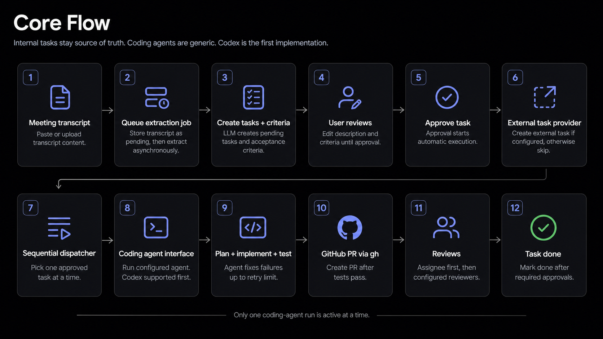
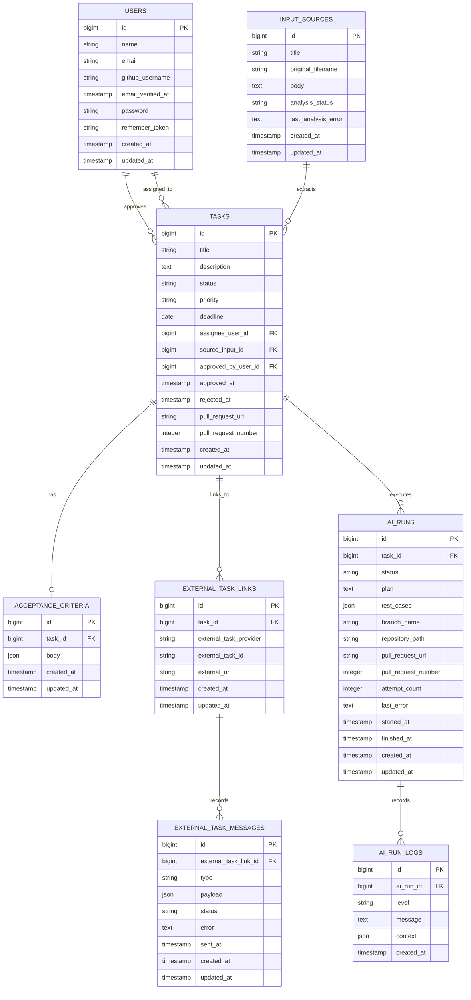

# SLC Implementation Plan: AI Task Runner With GitHub PR Flow

## Summary

Build a Laravel/Inertia task app where the app is the source of truth for tasks,
approval, AI execution state, logs, and GitHub pull request tracking.

Core flow:

```text
Text input file or pasted text
-> LLM analyzes the input and extracts small tasks
-> App stores tasks and acceptance criteria as pending approval
-> User edits task description and acceptance criteria until approving
-> App creates task in configured external task provider, or skips if none is configured
-> App automatically dispatches one approved task at a time
-> Laravel queued job invokes the configured coding agent with approved description and criteria
-> Coding agent plans, implements, tests, and fixes failures
-> App creates a GitHub PR through gh
-> Assignee reviews first
-> Assignee squash-merges after approval
-> Task becomes done after merge
```



The SLC is intentionally concrete: Laravel orchestrates the workflow, the
configured coding agent does the implementation work, and GitHub is used for
branches, pull requests, assignee review, and merge tracking only.

## Key Decisions

- The app owns task data and workflow state.
- External task providers are optional in v1. If no external task provider is configured,
  external task creation is skipped.
- GitHub integration uses the `gh` command.
- AI execution is automatic after approval and sequential: only one task run may
  execute at a time.
- The coding agent runner uses a configured local repository path.
- The coding agent runner does not use isolated worktrees in v1.
- Coding agents are accessed through a generic interface. Codex is the first
  supported implementation.
- The app uses one task workflow status, not separate approval and AI status
  fields.
- Input sources are generic text inputs, not meeting transcripts only. Users can
  paste text or upload any text file, and the app analyzes that input to create
  pending subtasks.

## Core Data Model



### Sample Data

These rows show the expected shape of the first useful local demo dataset.

#### `users`

Use Laravel's existing starter `users` table with one nullable GitHub username.
Do not store GitHub's numeric account ID.

| id | name | email | github_username | email_verified_at | password | remember_token | created_at | updated_at |
|---:|---|---|---|---|---|---|---|---|
| 1 | Jane Doe | jane@example.test | janedoe | null | hashed_password_value | null | 2026-05-02 09:00:00 | 2026-05-02 09:00:00 |
| 2 | John Doe | john@example.test | johndoe | null | hashed_password_value | null | 2026-05-02 09:00:00 | 2026-05-02 09:00:00 |

#### `input_sources`

| id | title | original_filename | body | analysis_status | last_analysis_error |
|---:|---|---|---|---|---|
| 1 | Auth Planning - 09:00 02/05/2026 | auth-planning-notes.txt | Meeting notes: create a sign in page, create a sign up page, connect auth navigation, and show clear validation feedback. | completed | null |

#### `tasks`

| id | title | status | priority | deadline | assignee_user_id | source_input_id | approved_by_user_id | approved_at | rejected_at | pull_request_url | pull_request_number |
|---:|---|---|---|---|---|---:|---:|---|---|---|---:|
| 1 | Create sign in page | done | high | 2026-05-08 | 1 | 1 | 1 | 2026-05-02 09:15:00 | null | https://github.com/example/product/pull/42 | 42 |
| 2 | Create sign up page | pending_approval | high | 2026-05-10 | 2 | 1 | null | null | null | null | null |
| 3 | Connect auth page navigation | rejected | medium | 2026-05-11 | null | 1 | null | null | 2026-05-02 09:20:00 | null | null |

#### `acceptance_criteria`

| id | task_id | body |
|---:|---:|---|
| 1 | 1 | `[{"body":"Render email and password fields with accessible labels.","checked":true},{"body":"Add remember-me and forgot-password actions.","checked":true},{"body":"Show validation errors without clearing entered email.","checked":true}]` |
| 2 | 2 | `[{"body":"Render name, email, password, and confirm password fields.","checked":false},{"body":"Require terms acknowledgement before account creation.","checked":false},{"body":"Show clear validation feedback.","checked":false}]` |

#### `external_task_links`

| id | task_id | external_task_provider | external_task_id | external_url |
|---:|---:|---|---|---|
| 1 | 1 | github-projects | PVTI_lADOExampleItem | https://github.com/orgs/example/projects/1/views/1?pane=issue&itemId=123 |

#### `external_task_messages`

| id | external_task_link_id | type | payload | status | error | sent_at |
|---:|---:|---|---|---|---|---|
| 1 | 1 | create | {"title":"Create sign in page","description":"...","priority":"high","deadline":"2026-05-08"} | success | null | 2026-05-02 09:15:30 |
| 2 | 1 | update | {"status":"done","pull_request_url":"https://github.com/example/product/pull/42"} | success | null | 2026-05-02 09:31:30 |

If no external task provider is configured, no external task link or message
rows are created.

#### `ai_runs`

| id | task_id | status | branch_name | repository_path | pull_request_url | pull_request_number | attempt_count | last_error | started_at | finished_at |
|---:|---:|---|---|---|---|---:|---:|---|---|---|
| 1 | 1 | done | ai-task-1-sign-in-page | /home/lkp/Workspace/example-product | https://github.com/example/product/pull/42 | 42 | 1 | null | 2026-05-02 09:16:00 | 2026-05-02 09:31:00 |
| 2 | 3 | failed | ai-task-3-auth-navigation | /home/lkp/Workspace/example-product | null | null | 2 | Tests failed after retry limit. | 2026-05-02 09:40:00 | 2026-05-02 09:54:00 |

#### `ai_run_logs`

| id | ai_run_id | level | message | context |
|---:|---:|---|---|---|
| 1 | 1 | info | Preflight passed: repository path exists and working tree is clean. | {"task_id":1} |
| 2 | 1 | info | Coding agent completed implementation. | {"agent":"codex","branch":"ai-task-1-sign-in-page"} |
| 3 | 1 | info | Tests passed. | {"command":"php artisan test --compact"} |
| 4 | 1 | info | Pull request created through gh. | {"pr":42} |
| 5 | 2 | error | Retry limit reached after failing tests. | {"attempt_count":2} |

### Task

Stores the user-facing task and its current workflow state.

Approval ownership uses the existing Laravel `users` table through
`approved_by_user_id`. Do not create a separate approver or app-user table in
v1.

When a task is manually created and no assignee is selected, the app may default
`assignee_user_id` to the current user when that user has a `github_username`.
Input analysis and task editing may still assign a different user per
task.

Required fields:

- `id`
- `title`
- `description`
- `status`
- `priority`
- `deadline`
- `assignee_user_id`
- `source_input_id`
- `approved_by_user_id`
- `approved_at`
- `rejected_at`
- `pull_request_url`
- `pull_request_number`
- `created_at`
- `updated_at`

Allowed task statuses:

- `draft`
- `pending_approval`
- `approved`
- `running`
- `pr_created`
- `done`
- `failed`
- `rejected`

Status rules:

- New manually created tasks start as `draft`.
- Extracted input tasks start as `pending_approval`.
- Only `approved` tasks are eligible for automatic AI execution.
- Rejected tasks are never eligible for AI execution.
- Editing key fields after approval resets the task to `pending_approval`.
- A task moves to `running` when its AI run starts.
- A task moves to `pr_created` after the GitHub PR is created.
- A task moves to `done` after the PR is merged.
- A task moves to `failed` when execution, testing, PR creation, or review
  tracking fails permanently.

### Acceptance Criteria

Stores one JSON checklist for a task. The `body` value is an array of checklist
item objects.

Required fields:

- `id`
- `task_id`
- `body`
- `created_at`
- `updated_at`

### External Task Link

Stores the optional external task created after approval. This is a visibility
mirror only; the app remains the source of truth. If no external task provider is
configured, the app skips external task creation and no row is stored.

Required fields:

- `id`
- `task_id`
- `external_task_provider`
- `external_task_id`
- `external_url`
- `created_at`
- `updated_at`

### External Task Message

Stores an append-only history of payloads sent to an external task provider.
Every create, update, comment, question, pull request attach, and retry attempt
creates a new row.

Required fields:

- `id`
- `external_task_link_id`
- `type`
- `payload`
- `status`
- `error`
- `sent_at`
- `created_at`
- `updated_at`

Allowed message statuses:

- `pending`
- `success`
- `failed`

### Input Source

Stores pasted text or uploaded text file content before task analysis. The
`title` may be provided by the user, derived from the uploaded filename, or
generated by the app in the format `Input - hh:mm dd/mm/yyyy`. The
`original_filename` column stores the uploaded filename when one exists. The
`body` column stores the raw text content.

Required fields:

- `id`
- `title`
- `original_filename`
- `body`
- `analysis_status`
- `last_analysis_error`
- `created_at`
- `updated_at`

Allowed analysis statuses:

- `pending`
- `processing`
- `completed`
- `failed`

### AI Run

Stores one execution attempt for an approved task.

Required fields:

- `id`
- `task_id`
- `status`
- `plan`
- `test_cases`
- `branch_name`
- `repository_path`
- `pull_request_url`
- `pull_request_number`
- `attempt_count`
- `last_error`
- `started_at`
- `finished_at`
- `created_at`
- `updated_at`

Allowed AI run statuses:

- `queued`
- `preparing`
- `planning`
- `implementing`
- `testing`
- `creating_pr`
- `waiting_for_merge`
- `done`
- `failed`

### AI Run Log

Stores append-only runner output and important lifecycle events.

Required fields:

- `id`
- `ai_run_id`
- `level`
- `message`
- `context`
- `created_at`

## Application Behavior

### Core Task App

- Replace the starter welcome page with a task board.
- Add task create, edit, and detail experiences as popups/modals over the task
  board instead of redirecting to separate task pages.
- The task detail popup shows task fields, acceptance criteria, source input,
  approval metadata, AI run history, task-specific logs, and GitHub PR state.
- Add a global logs page for checking logs across all tasks and AI runs.
- Add create, edit, approve, and reject actions.
- Use Laravel controllers, form requests, policies, queued jobs, and Inertia
  React pages.
- Use Wayfinder-generated route/action helpers from React instead of hardcoded
  URLs.

### Input Analysis

- Users can paste text or upload a text file.
- The HTTP request only stores the input source with `analysis_status` set to
  `pending`, dispatches a Laravel queued job, and returns immediately.
- Input analysis runs in the queued job, not in the HTTP request.
- The queued job sets `analysis_status` to `processing`, calls the
  `TaskExtractor` PHP contract, creates extracted tasks and acceptance criteria,
  then sets `analysis_status` to `completed`.
- On failure, the queued job sets `analysis_status` to `failed` and stores
  `last_analysis_error`.
- Extracted tasks are saved as `pending_approval`.
- The analysis job must create one acceptance criteria row for each extracted
  task.
- Users review and edit task description and acceptance criteria until they are
  ready to approve.
- Unclear extracted items should include questions in the task description.

Minimum extracted task shape:

```php
[
    'title' => 'string',
    'description' => 'string',
    'assignee_github_username' => 'string|null',
    'priority' => 'low|medium|high|urgent|null',
    'deadline' => 'date|null',
    'acceptance_criteria' => [
        ['body' => 'string', 'checked' => 'bool'],
    ],
    'questions' => ['string'],
]
```

If `assignee_github_username` is present, the analysis job resolves it to a
`users.github_username` row before storing `tasks.assignee_user_id`. If no known
user matches, the task is still created without an assignee and the unresolved
username is added to the task description as a question.

### Approval Workflow

- Approval is the gate for AI execution.
- Approving a task stores `approved_by_user_id` and `approved_at`, then sets
  status to `approved`.
- Approval automatically dispatches the sequential AI dispatcher job. There is
  no separate manual run action in v1.
- After approval, the app attempts to create the task in the configured external
  task provider.
- If no external task provider is configured, external task creation is skipped
  and the task remains eligible to run.
- If sending a message to the external task provider fails, the failure is stored
  in `external_task_messages` and surfaced on the task detail page without
  corrupting the internal task.
- Rejecting a task stores `rejected_at` and sets status to `rejected`.
- Editing title, description, assignee, priority, deadline, or acceptance
  criteria after approval clears approval metadata and resets status to
  `pending_approval`.

### Sequential Coding Agent Runner

- `DispatchNextAiRunJob` is the coordinator job.
- `RunApprovedTaskWithCodingAgentJob` is the execution job.
- Approving any task dispatches `DispatchNextAiRunJob`.
- The dispatcher refuses to start a new run if another AI run is active.
- The dispatcher picks the next eligible `approved` task, creates an `AI Run`,
  and dispatches `RunApprovedTaskWithCodingAgentJob`.
- The execution job refuses to start if the configured repository path is
  missing.
- The execution job refuses to start if the target repository has uncommitted
  changes.
- The execution job creates a dedicated branch in the configured repository path.
- The execution job invokes the configured coding agent with the approved task
  description and acceptance criteria.
- `CodexCodingAgent` is the first supported coding agent implementation.
- The coding agent automatically plans, implements, runs tests, and fixes
  failures up to the configured retry limit.
- The execution job captures coding agent output in `AI Run Log` records.
- The execution job runs the configured test command after the coding agent
  completes.
- If tests fail, the job allows the coding agent to fix and retry up to the
  configured retry limit.
- Retry exhaustion marks the AI run and task as `failed`.
- After a run finishes, fails, or creates a PR, the execution job dispatches
  `DispatchNextAiRunJob` again so the next approved task can start
  automatically.

### GitHub PR Flow

- PR creation uses `gh pr create`.
- Reviewer operations use `gh pr edit --add-reviewer` or the appropriate `gh`
  PR command.
- The task assignee's `users.github_username` is requested as the first reviewer. This uses
  `gh pr create --reviewer` or `gh pr edit --add-reviewer`, not GitHub PR
  assignee assignment.
- Merge status checks use `gh pr view` with JSON output.
- The task is marked `done` after the PR is merged.
- `gh` failures are stored on the AI run and surfaced in the task detail page.

## PHP Interfaces

Define PHP contracts for replaceable integrations:

```php
interface TaskExtractor
{
    /**
     * @return array<int, array{
     *     title: string,
     *     description: string,
     *     assignee_github_username: string|null,
     *     priority: string|null,
     *     deadline: string|null,
     *     acceptance_criteria: array<int, array{body: string, checked: bool}>,
     *     questions: array<int, string>
     * }>
     */
    public function extract(InputSource $inputSource): array;
}
```

```php
interface CodingAgent
{
    public function run(Task $task, AiRun $run): CodingAgentResult;
}
```

```php
interface ExternalTaskProvider
{
    public function createTask(Task $task): ExternalTaskResult;

    public function addComment(ExternalTaskLink $link, string $comment): void;

    public function attachPullRequest(ExternalTaskLink $link, string $pullRequestUrl): void;
}
```

```php
interface PullRequestProvider
{
    public function createPullRequest(Task $task, AiRun $run): PullRequestResult;

    public function requestReview(string $pullRequestUrl, User $user): void;

    public function getReviewState(string $pullRequestUrl): PullRequestReviewState;
}
```

The first `PullRequestProvider` implementation uses the local `gh` command.
The first `ExternalTaskProvider` may also use GitHub, but external task creation
remains optional and is skipped when no external task provider is configured.
The first `CodingAgent` implementation is `CodexCodingAgent`.

## Implementation Phases

1. **Internal Task App**
   - Add task, acceptance criteria, input source, external task link, external
     task message, AI run, and AI run log models.
   - Build task board and task create/edit/detail popups.
   - Build a global logs page for all task and AI run logs.
   - Add create, edit, approve, and reject actions.

2. **Input to Tasks**
   - Add text paste/upload.
   - Store input sources before analysis.
   - Implement the `TaskExtractor` contract.
   - Save extracted tasks as `pending_approval`.

3. **Sequential Coding Agent Runner**
   - Create external task links after approval when an external task provider is
     configured.
   - Create an external task message row for every provider create, update,
     comment, question, pull request attach, and retry attempt.
   - Skip external task creation when no external task provider is configured.
   - Add `DispatchNextAiRunJob` and `RunApprovedTaskWithCodingAgentJob`.
   - Enforce one active run at a time.
   - Preflight the configured repository path.
   - Create branch, invoke the configured coding agent, run tests, retry
     failures, and store logs.
   - Dispatch the next approved task automatically after each run exits.

4. **GitHub PR and Review Flow**
   - Implement `PullRequestProvider` with `gh`.
   - Create PRs after passing tests.
   - Request assignee review.
   - Poll or manually refresh PR merge state.
   - Mark task `done` after the PR is merged.

## Test Plan

### Task Lifecycle

- Manually created tasks start as `draft`.
- Extracted tasks start as `pending_approval`.
- Pending tasks are not eligible for automatic AI execution.
- Approved tasks become eligible for automatic AI execution.
- Rejected tasks never execute.
- Editing key fields after approval resets the task to `pending_approval`.
- Creating, editing, and viewing task details opens a popup without navigating
  away from the task board.
- The task detail popup shows logs for that task.
- The global logs page shows logs across all tasks and AI runs.

### External Task Creation

- Approved task creates an external task when an external task provider is
  configured.
- Approved task skips external task creation when no external task provider is
  configured.
- External task message failure is recorded without changing the internal approval.
- External task link stores external task provider name, external task ID,
  and external URL.
- Every external task create, update, comment, question, pull request attach,
  and retry records an external task message row with type, payload, status,
  error, and sent timestamp.

### Input Analysis

- Input submission returns immediately after storing the input source and
  dispatching the analysis job.
- The analysis job moves input source status from `pending` to `processing`.
- An input source with multiple action items creates multiple pending tasks.
- Each extracted task includes one acceptance criteria checklist.
- Unclear items include questions in the task description.
- Extracted tasks include title, description, priority, deadline, assignee user,
  and acceptance criteria.
- Successful analysis sets input source status to `completed`.
- Analysis failure sets input source status to `failed` and stores
  `last_analysis_error` without creating partial tasks.

### Coding Agent Runner

- Approving a task dispatches the sequential AI dispatcher.
- The dispatcher creates an AI run for the next eligible approved task.
- A second active run cannot start while one run is active.
- Finishing one run automatically dispatches the next approved task when one is
  available.
- Missing repository path marks the run failed.
- Dirty repository preflight marks the run failed.
- The coding agent receives the approved task description and acceptance
  criteria.
- Coding agent output is stored as run logs.
- Passing tests create a PR.
- Failing tests trigger retries.
- Retry exhaustion marks the run and task failed.

### GitHub PR Flow

- Successful PR creation stores PR URL and number.
- PR creation failure marks the run failed and stores the error.
- Assignee review is requested after PR creation.
- Task becomes `done` after the assignee squash-merges the PR.

## Assumptions

- This is a single-user/local SLC.
- The existing Laravel `User` model is enough for approval ownership in v1.
- App users may store one `github_username`.
- Task assignees select existing users with a `github_username`.
- The app has access to a configured local repository path.
- The local environment already has the selected coding agent command, `gh`,
  Git, and repository credentials configured.
- The target repository can be checked for dirty state before every run.
- Real-time external task sync, required external task mirroring, isolated worktrees, and
  parallel AI execution are deferred.
